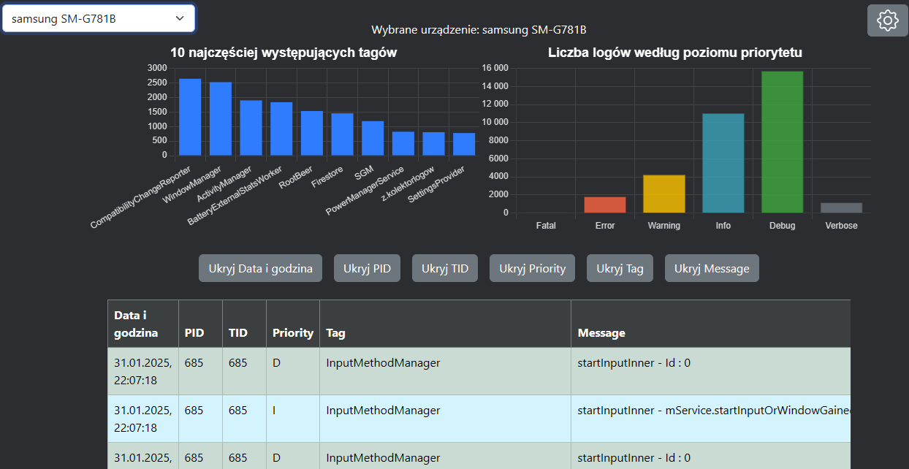
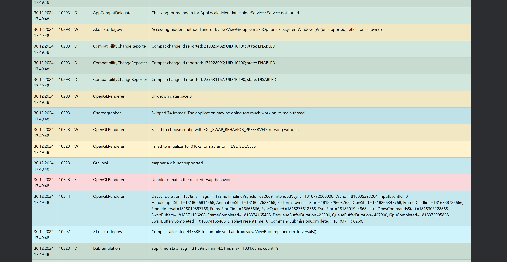

# 🌐 LogCollectorWeb

**LogCollectorWeb** is a browser-based interface designed to visualize and analyze logs collected from Android devices. Logs are fetched from Firestore and displayed in an intuitive interface with support for log browsing, filtering, and basic analysis.

This application is part of a broader system for remote log collection, but this repository contains **only the frontend web client**.

---

## 📸 Screenshots

### 🔍 Log Viewer Interface


### 📊 Logs list

---

## ⚙️ Features

- 📋 Displays logs from Android devices stored in Firestore.
- 🧮 Visualizes log priority distribution via chart (e.g. verbose, info, warn, error).
- 📱 Device selection via dropdown list (top-left).
- 🚫 Device removal option via settings menu (top-right).
- 🕹️ Toggle column visibility to customize the view.
- 📡 Fetches data dynamically using Firebase SDK.

---

## 🛠️ Tech Stack

- **Languages**: JSX, XML, CSS
- **Libraries and frameworks**: React + Vite, Chart.js, Bootstrap
- **Data**: Firebase Firestore (via Web SDK)

---

## 🧱 Project Structure

```
LogCollectorWeb/
├── public/
├── src/
│   ├── components/          # Reusable UI elements
│   ├── pages/               # Page layouts
│   ├── firebase/            # Firestore integration
│   ├── App.tsx              # Main app
│   └── main.tsx             # Vite entry
├── screenshots/             # full-screen screenshots 
├── README.md
└── vite.config.ts
```

---

## 🚀 Getting Started

1. Clone the repository:
   ```bash
   git clone https://github.com/thekosa/LogCollectorWeb.git
   cd LogCollectorWeb
   ```

2. Install dependencies:
   ```bash
   npm install
   ```

3. Set up your Firebase credentials (see `.env.example`):
   ```env
   VITE_FIREBASE_API_KEY=...
   VITE_FIREBASE_PROJECT_ID=...
   VITE_FIREBASE_APP_ID=...
   ```

4. Run locally:
   ```bash
   npm run dev
   ```
---

## 👨‍🎓 About the Project

This web app is part of an engineering thesis focused on building a system for collecting, analyzing, and visualizing logs from Android devices. The goal is to provide a lightweight, responsive frontend to help administrators monitor multiple devices remotely.

---

## 👤 Author

Michał Kosieradzki  
GitHub: [@thekosa](https://github.com/thekosa)  
Repository: [github.com/thekosa/LogCollectorWeb](https://github.com/thekosa/LogCollectorWeb)


---

## 📌 Notes

- This repository includes only the **web-based log viewer**.
- The companion Android app responsible for collecting logs is [here](https://github.com/thekosa/LogCollector).
